# Architecture Overview

## System Design

This document explains the technical architecture, design patterns, and key decisions behind the Username Browser application.

---

## High-Level Architecture

```mermaid
graph LR
    %% ======================
    %% CLIENT & EDGE
    %% ======================
    Client["🌐 Client<br/>Web / Mobile"] 
        -->|HTTPS| Gateway["🛡️ API Gateway<br/>CORS • Rate Limit • Compression"]

    %% ======================
    %% API LAYER
    %% ======================
    Gateway --> Router["🚦 Express Router<br/>/api/users"]
    Router --> Controller["🎮 Controller<br/>Parse params"]
    Controller --> Validators["✅ Validators<br/>letter • cursor • limit"]

    Validators -->|Invalid| ErrorHandler["❌ Error Handler<br/>4xx / 5xx"]
    Validators -->|Valid| Service["🧠 User Service<br/>Business Logic"]

    %% ======================
    %% SERVICE LAYER
    %% ======================
    Service -->|Check Index| IndexCheck{Index Ready?}
    IndexCheck -->|No| BuildIndex["⚙️ Build Index<br/>Startup Only"]
    IndexCheck -->|Yes| Repository["📦 Repository<br/>Data Access"]

    BuildIndex -->|Store in RAM| Repository

    %% ======================
    %% DATA & IO
    %% ======================
    Repository -->|Cursor Pagination| Stream["📖 File Stream<br/>readline"]
    Stream --> FileSystem["💾 usernames.txt<br/>10M+ rows"]
    FileSystem --> Stream
    Stream --> Repository

    %% ======================
    %% RESPONSE PATHS
    %% ======================
    Repository --> Service
    Service --> Controller
    Controller -->|JSON Response| Client
    ErrorHandler -->|JSON Error| Client

    %% ======================
    %% OPTIONAL ENHANCEMENTS
    %% ======================
    Service -.->|Future| Cache["⚡ Cache<br/>Redis / LRU"]
    Router -.->|Future| Logs["📊 Logs & Metrics<br/>Winston / Prometheus"]

    %% ======================
    %% STYLING
    %% ======================
    style Client fill:#e3f2fd
    style Gateway fill:#ede7f6
    style Router fill:#ede7f6
    style Controller fill:#fff3e0
    style Validators fill:#ffebee
    style Service fill:#e8f5e9
    style Repository fill:#e8f5e9
    style Stream fill:#f1f8e9
    style FileSystem fill:#eeeeee
    style Cache fill:#e0f2f1
    style ErrorHandler fill:#ffcdd2
    style Logs fill:#fff9c4
    style BuildIndex fill:#e1bee7
```



---

## Clean Architecture Layers

### 1. Routes Layer (`/routes`)
**Purpose:** API interface definition

**Responsibilities:**
- Define URL endpoints
- Map HTTP methods to controllers
- Include Swagger/OpenAPI documentation

**Example:**
```javascript
router.get('/index', userController.getIndex);
router.get('/', userController.getUsersByLetter);
```

---

### 2. Controller Layer (`/controllers`)
**Purpose:** HTTP request/response handling

**Responsibilities:**
- Parse query parameters
- Call validators for input validation
- Delegate to service layer
- Format JSON responses
- Pass errors to error handler

**Example:**
```javascript
async getUsersByLetter(req, res, next) {
  const { letter, cursor = '0', limit } = req.query;
  const validatedLetter = validateLetter(letter);
  const validatedCursor = validateCursor(cursor);
  const result = await UserService.getUsersByLetter(...);
  res.json(result);
}
```

**Key Insight:** Controllers don't contain business logic - they're just HTTP adapters.

---

### 3. Service Layer (`/services`)
**Purpose:** Business logic orchestration

**Responsibilities:**
- Initialize index at startup
- Calculate pagination metadata (hasMore, nextCursor)
- Validate cursor bounds before streaming
- Coordinate repository calls
- Throw custom errors (NotFoundError, etc.)

**Example:**
```javascript
async getUsersByLetter(letter, cursor, limit) {
  const indexEntry = Repository.getIndexForLetter(letter);
  if (!indexEntry) throw new NotFoundError(...);
  
  const startPosition = indexEntry.startPosition + cursor;
  const users = await Repository.streamUsers(startPosition, limit);
  
  return { data: users, hasMore: ..., nextCursor: ... };
}
```

**Key Insight:** Service layer is the only place where pagination logic lives.

---

### 4. Repository Layer (`/repositories`)
**Purpose:** Data access abstraction

**Responsibilities:**
- Build alphabetical index (one-time at startup)
- Stream users from file using Node.js readline
- Calculate file positions for cursors
- Abstract file system details from service layer

**Example:**
```javascript
async buildIndex() {
  const indexMap = new Map();
  let currentPosition = 0;
  
  for await (const line of rl) {
    const firstLetter = line[0].toUpperCase();
    if (!indexMap.has(firstLetter)) {
      indexMap.set(firstLetter, {
        letter: firstLetter,
        count: 0,
        startPosition: currentPosition
      });
    }
    indexMap.get(firstLetter).count++;
    currentPosition++;
  }
  
  return Array.from(indexMap.values());
}
```

**Key Insight:** Repository handles ALL file I/O - no other layer touches the file system.

---

### 5. Utils Layer (`/utils`)
**Purpose:** Reusable utilities

**Components:**
- **Custom Errors:** AppError, ValidationError, NotFoundError
- **Validators:** validateLetter, validateCursor, validateLimit

**Example:**
```javascript
function validateLetter(letter) {
  if (!letter || typeof letter !== 'string') {
    throw new ValidationError('Letter parameter is required');
  }
  if (!/^[A-Z]$/i.test(letter)) {
    throw new ValidationError('Invalid letter parameter. Must be A-Z');
  }
  return letter.toUpperCase();
}
```

---

## Key Technical Decisions

### 1. File Streaming Instead of Database

**Decision:** Use Node.js `readline` to stream text file line-by-line.

**Rationale:**
- Data is read-only and pre-sorted alphabetically
- No need for CRUD operations
- Simpler deployment (no database setup)
- Demonstrates algorithmic efficiency (core requirement)

**Trade-offs:**
- ✅ Pros: Simple, fast, memory-efficient
- ❌ Cons: Can't handle concurrent writes (not needed), slower than indexed DB for complex queries

---

### 2. In-Memory Index

**Decision:** Build index once at startup, store in memory.

**Rationale:**
- Index is tiny (~1KB for 26 letters)
- Avoids rebuilding on every request
- O(1) lookup time for letter positions

**Structure:**
```javascript
[
  { letter: 'A', count: 1250430, startPosition: 0 },
  { letter: 'B', count: 982345, startPosition: 1250430 },
  // ...
]
```

**Memory Usage:** ~40 bytes × 26 letters = ~1KB

---

### 3. Cursor-Based Pagination

**Decision:** Use absolute positions (cursor) instead of page numbers.

**Why not page numbers?**
```javascript
// Page-based (problematic)
page=1 → skip 0, take 50     // Lines 0-49
page=2 → skip 50, take 50    // Lines 50-99

// Problem: If data changes between requests, results shift
```

**Cursor-based (reliable):**
```javascript
cursor=0, limit=50   → startPos=0, read 50    // Lines 0-49
cursor=50, limit=50  → startPos=50, read 50   // Lines 50-99

// Benefit: cursor always points to same absolute position
```

**How we calculate position:**
```javascript
const absolutePosition = indexEntry.startPosition + cursor;
```

---

### 4. Singleton Pattern for Services

**Decision:** Export singleton instances, not classes.

**Why?**
```javascript
// Service maintains state (initialized flag)
class UserService {
  constructor() {
    this.initialized = false;
  }
  async initialize() { ... }
}

// Export singleton - same instance across all requests
module.exports = new UserService();
```

**Benefit:** Index built once, shared across all requests. No redundant initialization.

---

### 5. Custom Error Classes

**Decision:** Create typed errors (ValidationError, NotFoundError) instead of throwing raw Error objects.

**Why?**
```javascript
// Before
throw new Error('Invalid letter'); // No status code, no error code

// After
throw new ValidationError('Invalid letter parameter. Must be A-Z', 'INVALID_LETTER');
// Automatically becomes 400 response with structured JSON
```

**Benefit:** Consistent error responses, proper HTTP status codes, structured logging.

---

## Data Flow Examples

### Example 1: Get Users for Letter "A"

**Request:**
```
GET /api/users?letter=A&cursor=0&limit=50
```

**Flow:**
1. **Router** receives request → calls `userController.getUsersByLetter`
2. **Controller** extracts params → calls validators
3. **Validators** check `letter='A'` (valid), `cursor=0` (valid), `limit=50` (valid)
4. **Service** calls `Repository.getIndexForLetter('A')`
5. **Repository** returns `{ letter: 'A', count: 1250430, startPosition: 0 }`
6. **Service** calculates `startPosition = 0 + 0 = 0`
7. **Repository** streams file from position 0, reads 50 lines
8. **Service** calculates `nextCursor = 0 + 50 = 50`, `hasMore = true`
9. **Controller** returns JSON:
```json
{
  "letter": "A",
  "cursor": 0,
  "limit": 50,
  "data": ["aaron123", "abby_cool", ...],
  "hasMore": true,
  "nextCursor": 50,
  "total": 1250430
}
```

---

### Example 2: Error Handling

**Request:**
```
GET /api/users?letter=999&cursor=0&limit=50
```

**Flow:**
1. **Controller** calls `validateLetter('999')`
2. **Validator** throws `ValidationError('Invalid letter parameter. Must be A-Z', 'INVALID_LETTER')`
3. **Express error handler** catches error
4. **Error handler** checks `err instanceof ValidationError` → returns 400:
```json
{
  "error": "ValidationError",
  "message": "Invalid letter parameter. Must be A-Z",
  "code": "INVALID_LETTER"
}
```

---

## SOLID Principles Applied

### Single Responsibility Principle
- **Routes:** URL mapping only
- **Controllers:** HTTP handling only
- **Services:** Business logic only
- **Repositories:** Data access only
- **Validators:** Input validation only

### Open/Closed Principle
- New error types extend `AppError` without modifying existing code
- New validators can be added without changing validation logic

### Liskov Substitution Principle
- All error classes can replace `AppError` in error handler
- `ValidationError`, `NotFoundError` interchangeable

### Interface Segregation Principle
- Small, focused functions (validateLetter, validateCursor)
- Controllers don't expose repository methods

### Dependency Inversion Principle
- Service depends on Repository interface, not file system
- Controller depends on Service abstraction, not data layer
- Configuration centralized in `/config`, not hardcoded

---

## Performance Characteristics

### Time Complexity

| Operation | Complexity | Notes |
|-----------|-----------|-------|
| **Index Build** | O(n) | Scans file once at startup |
| **Index Lookup** | O(1) | Array find (max 26 items) |
| **Stream Users** | O(m) | Reads m lines where m = limit |
| **Pagination Calc** | O(1) | Simple arithmetic |

Where:
- n = total usernames (10M)
- m = page size (typically 50)

### Space Complexity

| Component | Space | Notes |
|-----------|-------|-------|
| **Index** | O(1) | ~1KB for 26 letters |
| **Per Request** | O(m) | m = limit (50 users = ~1KB) |
| **Total RAM** | ~35MB | Node.js + index + buffers |

**Key Insight:** Memory usage is independent of dataset size. Works for 10M or 100M usernames with same RAM.

---

## Security Considerations

### 1. Input Validation
- All user inputs validated before processing
- Regex checks for letter format
- Numeric bounds for cursor/limit

### 2. Error Handling
- No sensitive info in error messages (no file paths)
- Custom error codes for debugging
- Consistent error format

### 3. Docker Security
- Non-root user in backend container
- Read-only volume for data file
- Network isolation between services

### 4. CORS Configuration
- Configured for specific frontend origin
- Prevents unauthorized API access from other domains

---

## Scalability

### Horizontal Scaling
```
Load Balancer
    ↓
Backend 1 ← shared /data volume
Backend 2 ← shared /data volume
Backend 3 ← shared /data volume
```

**Works because:**
- Index built per instance (fast: 2-3s)
- No shared state between requests
- File reads are thread-safe

### Vertical Scaling
- Current: 35MB RAM per instance
- 10× data (100M users): Still ~35MB RAM
- 100× data (1B users): Still ~35MB RAM

**Why?** Streaming architecture doesn't load data into memory.

---

## Testing Strategy

### Unit Tests
- Repository: File streaming, index building
- Service: Pagination logic, error handling
- Validators: Input validation rules

### Integration Tests
- API endpoints with Supertest
- Full request/response cycle
- Error scenarios (404, 400)

### Coverage
- 38 tests passing
- Controllers: 100%
- Services: 100%
- Repositories: 100%
- Utils: 100%

---

## Future Enhancements

### Potential Improvements
1. **Caching:** Redis for frequently accessed letters (A, B, C)
2. **Compression:** Gzip responses to reduce bandwidth
3. **Rate Limiting:** Prevent abuse (1000 req/15min per IP)
4. **Monitoring:** Prometheus metrics for latency/errors
5. **Logging:** Structured logs with Winston/Pino

### Database Migration Path
If requirements change:
1. Keep current API contract
2. Replace Repository implementation
3. Use PostgreSQL with btree index on first_letter
4. Service layer unchanged

**Key Insight:** Clean architecture makes it easy to swap data layers without touching business logic.

---

**Last Updated:** 2026-01-04  
**Author:** Taha BENMALEK