# Architecture Overview

## System Design

Technical architecture and key decisions for the Username Browser application.

---

## High-Level Architecture

```mermaid
graph LR
    %% ======================
    %% CLIENT & EDGE
    %% ======================
    Client["🌐 Client<br/>Web / Mobile"] 
        -->|HTTPS| Gateway["🛡️ API Gateway<br/>CORS • Rate Limit • Compression"]

    %% ======================
    %% API LAYER
    %% ======================
    Gateway --> Router["🚦 Express Router<br/>/api/users"]
    Router --> Controller["🎮 Controller<br/>Parse params"]
    Controller --> Validators["✅ Validators<br/>letter • cursor • limit"]

    Validators -->|Invalid| ErrorHandler["❌ Error Handler<br/>4xx / 5xx"]
    Validators -->|Valid| Service["🧠 User Service<br/>Business Logic"]

    %% ======================
    %% SERVICE LAYER
    %% ======================
    Service -->|Check Index| IndexCheck{Index Ready?}
    IndexCheck -->|No| BuildIndex["⚙️ Build Index<br/>Startup Only"]
    IndexCheck -->|Yes| Repository["📦 Repository<br/>Data Access"]

    BuildIndex -->|Store in RAM| Repository

    %% ======================
    %% DATA & IO
    %% ======================
    Repository -->|Cursor Pagination| Stream["📖 File Stream<br/>readline"]
    Stream --> FileSystem["💾 usernames.txt<br/>10M+ rows"]
    FileSystem --> Stream
    Stream --> Repository

    %% ======================
    %% RESPONSE PATHS
    %% ======================
    Repository --> Service
    Service --> Controller
    Controller -->|JSON Response| Client
    ErrorHandler -->|JSON Error| Client

    %% ======================
    %% OPTIONAL ENHANCEMENTS
    %% ======================
    Service -.->|Future| Cache["⚡ Cache<br/>Redis / LRU"]
    Router -.->|Future| Logs["📊 Logs & Metrics<br/>Winston / Prometheus"]

    %% ======================
    %% UNIFIED STYLING
    %% ======================
    style Client fill:#ffffff,stroke:#000000,color:#000000
    style Gateway fill:#ffffff,stroke:#000000,color:#000000
    style Router fill:#ffffff,stroke:#000000,color:#000000
    style Controller fill:#ffffff,stroke:#000000,color:#000000
    style Validators fill:#ffffff,stroke:#000000,color:#000000
    style Service fill:#ffffff,stroke:#000000,color:#000000
    style Repository fill:#ffffff,stroke:#000000,color:#000000
    style Stream fill:#ffffff,stroke:#000000,color:#000000
    style FileSystem fill:#ffffff,stroke:#000000,color:#000000
    style Cache fill:#ffffff,stroke:#000000,color:#000000
    style ErrorHandler fill:#ffffff,stroke:#000000,color:#000000
    style Logs fill:#ffffff,stroke:#000000,color:#000000
    style BuildIndex fill:#ffffff,stroke:#000000,color:#000000
    style IndexCheck fill:#ffffff,stroke:#000000,color:#000000
```



---

## Architecture Layers

### Routes
- Define URL endpoints and HTTP method mapping
- API documentation

### Controllers
- Parse and validate query parameters
- Delegate to service layer
- Format JSON responses

### Services
- Initialize index at startup
- Calculate pagination metadata
- Orchestrate repository calls

### Repositories
- Build alphabetical index once at startup
- Stream users using Node.js readline
- Abstract file system operations

### Utils
- Custom errors: AppError, ValidationError, NotFoundError
- Validators: validateLetter, validateCursor, validateLimit

---

## Key Technical Decisions

### File Streaming
Node.js `readline` streams text file line-by-line instead of using a database.

**Rationale:** Read-only pre-sorted data, no CRUD operations, simpler deployment.

### In-Memory Index
Index built once at startup (~1KB for 26 letters):

```javascript
[
  { letter: 'A', count: 1250430, startPosition: 0 },
  { letter: 'B', count: 982345, startPosition: 1250430 }
]
```

O(1) lookup time, shared across all requests.

### Cursor-Based Pagination
Absolute positions instead of page numbers:

```javascript
const absolutePosition = indexEntry.startPosition + cursor;
```

Reliable pagination even if data changes between requests.

### Singleton Services
Export singleton instances to share index across requests without redundant initialization.

### Custom Error Classes
Typed errors provide consistent responses with proper HTTP status codes.

---

## Performance

### Time Complexity
- Index Build: O(n) - once at startup
- Index Lookup: O(1)
- Stream Users: O(m) where m = limit
- Pagination: O(1)

### Space Complexity
- Index: ~1KB
- Per Request: ~1KB for 50 users
- Total RAM: ~35MB (constant regardless of dataset size)

---

## Security

- Input validation with regex and bounds checking
- No sensitive information in error messages
- Docker non-root user and read-only volumes
- CORS configured for frontend origin

---

## Scalability

**Horizontal:** Multiple backend instances share read-only data volume. Index built per instance (2-3s).

**Vertical:** Streaming keeps memory constant (~35MB) for 10M, 100M, or 1B users.

---

## Testing

- 38 tests passing
- 100% coverage on all layers
- Unit and integration tests

---

## Future Enhancements

- Redis caching for frequent letters
- Response compression
- Rate limiting
- Prometheus metrics
- Structured logging

Clean architecture allows swapping Repository implementation without changing Service layer.

---

**Last Updated:** 2026-01-04  
**Author:** Taha BENMALEK